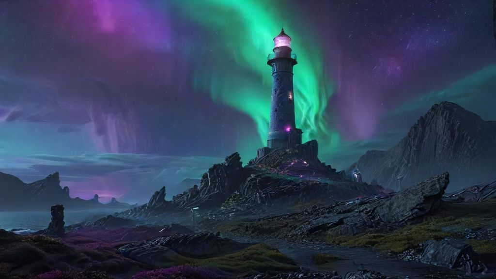
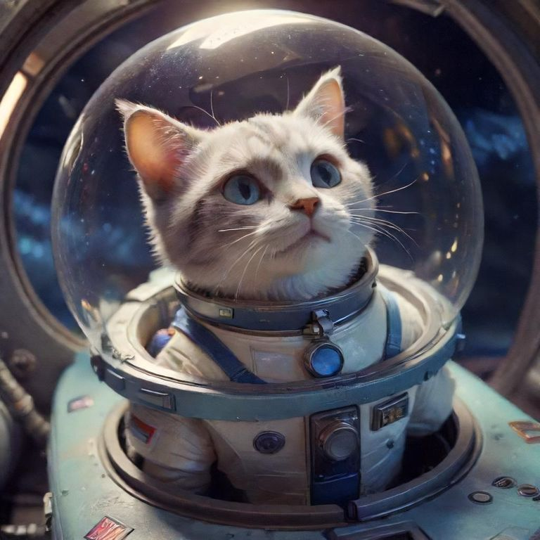
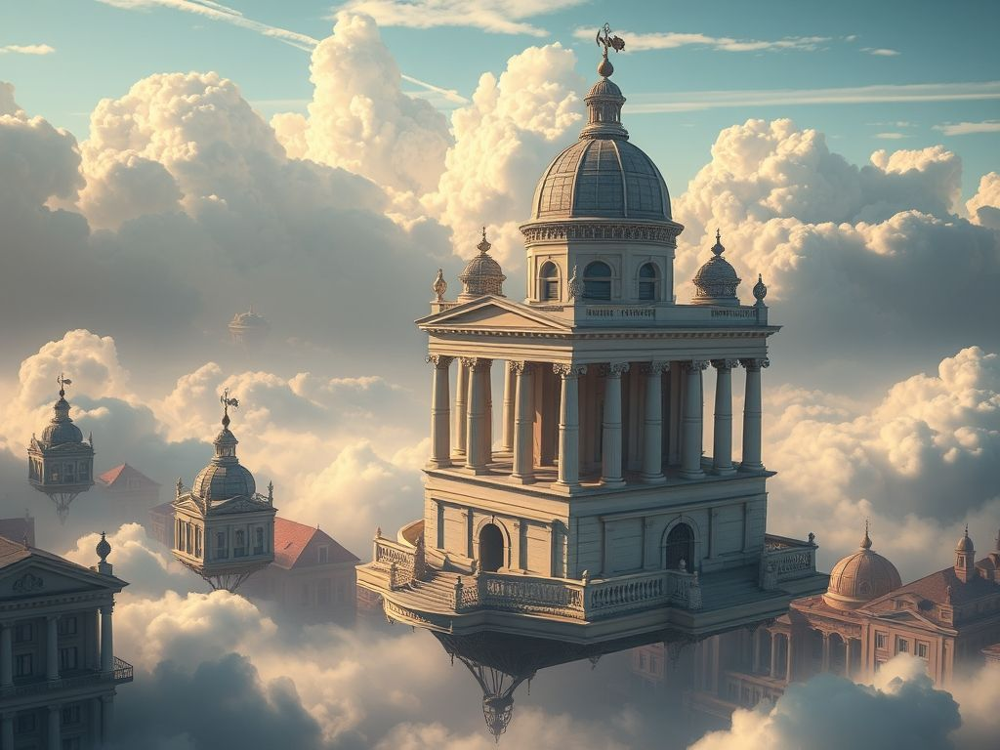
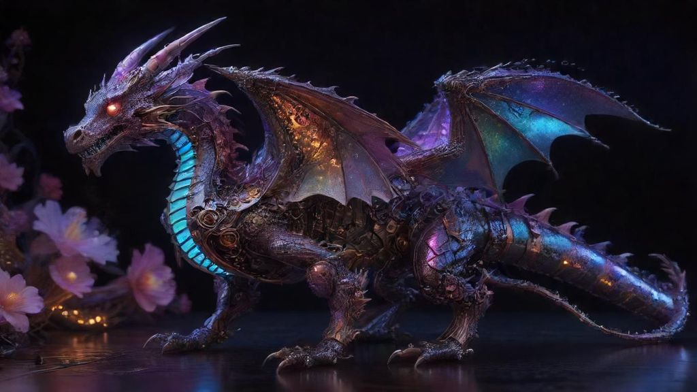

# 🖼️ Commandes de Génération d'Images 

## `/image` - Génération d'une image unique
**Paramètres** :
| Émoji | Paramètre     | Description                                                                 | Valeur par défaut |
|-------|---------------|-----------------------------------------------------------------------------|-------------------|
| 📝    | `prompt`      | Description détaillée de l'image (**obligatoire**)                         | -                 |
| ⚙️    | `model`      | Choix du modèle (`Flux` ou `Turbo`)                                         | `Flux`            |
| 📐    | `size`      | Dimensions au format `{largeur}x{hauteur}`                                     | `1024x1024`       |
| 🔒    | `private`      | `True` pour garder l'image privée                                          | `False`           |
| 🧠    | `enhance`| `True` pour amélioration automatique du prompt par IA                      | `False`           |

**Exemple complet** :
```html
/image prompt:"Un phare futuriste sur une planète extraterrestre, aurores boréales" size:2048x1024 model:SDXL
```


**Exemple avancé** :
```html
/multimage prompt:"Un loup blanc majestueux se tient sur un rocher moussu au milieu d'une ancienne forêt enchantée à l'aube. La fourrure du loup est illuminée par la douce lumière dorée du soleil qui filtre à travers les grands pins brumeux. De minuscules lucioles bleues flottent autour de lui et de délicates fleurs sauvages fleurissent à ses pieds. La scène est peinte dans un style hyperréaliste, avec des détails complexes sur la fourrure du loup et la texture de la mousse. L'atmosphère est sereine, magique et légèrement mystérieuse, évoquant le sentiment d'une illustration de conte de fées." size:1024x768 enhance:True
```

![Un loup blanc majestueux se tient sur un rocher moussu au milieu d'une ancienne forêt enchantée à l'aube. La fourrure du loup est illuminée par la douce lumière dorée du soleil qui filtre à travers les grands pins brumeux. De minuscules lucioles bleues flottent autour de lui et de délicates fleurs sauvages fleurissent à ses pieds. La scène est peinte dans un style hyperréaliste, avec des détails complexes sur la fourrure du loup et la texture de la mousse. L'atmosphère est sereine, magique et légèrement mystérieuse, évoquant le sentiment d'une illustration de conte de fées.](assets/wolf.png)

## 📌 Bonnes pratiques
> 💡 **Astuce** : Plus le prompt est descriptif, meilleurs sont les résultats. Incluez :
> - Style artistique (réaliste, cartoon, watercolor...)
> - Éclairage (lumière dorée, néons cyberpunk...)
> - Contexte (environnement, saison, éléments décoratifs)

> 🇬🇧 **Astuce** : Les prompts en anglais donnent souvent de meilleurs résultats.

> ⚠️ **Limitations** :
> - Taille maximale : `2048x2048`
> - Temps de traitement : ~10s/image en moyenne

> 🔞 **NSFW** :
> - NSFW non disponible pour le moment
> - Vous êtes responsables des images produites, des poursuites sont possibles pour les contenus incluant de la pédopornographie

## 🎨 Exemples de résultats



**Paramètres de génération** :  
| 📝 Prompt       | ⚙️ Modèle | 📐 Taille   | 🧠 Amélioration | 🔒 Privée |  
|-----------------|----------|-------------|-----------------|----------|  
| "Chat astronautique dans un vaisseau spatial, dessin animé Pixar" | Turbo | 1024x1024 | Non | Non | 


---

 

**Paramètres de génération** :  
| 📝 Prompt       | ⚙️ Modèle | 📐 Taille | 🧠 Amélioration |  
|-----------------|----------|-----------|-----------------|
| "Ville flottante dans les nuages, architecture néo-classique" | Flux | 1024x768 | Oui |


---



**Paramètres de génération** :  
| 📝 Prompt       | ⚙️ Modèle | 📐 Taille    | 🧠 Amélioration |
|-----------------|----------|--------------|-----------------|
| "Dragon cybernétique entouré de fleurs numériques, style steampunk" | Turbo | 1920x1080 | Oui |


## 🔄 FAQ courante

**Q** : Je reçois un message "`Une erreur est survenue lors de la génération de l'image. Réessayez plus tard.`" quand je tente de générer une image, que faire ?

**R** : Il suffit de réessayer, ce phénomène est passager, il suffit donc d'attendre quelques secondes à quelques minutes avant un retour à la normale. Si le phénomène se reproduit très souvent, ou alors que vous ne recevez même plus de messages d'erreur, je vous invite à me contacter grâce à la commande `/contact`.

---

**Q** : L'édition d'images est-elle supportée ?

**R** : Non, et ce ne sera pas le cas, jusqu'à ce que le fournisseur d'API (Pollinations) le supporte nativement.

--- 

**Q** : Y-a-t-il une limite au nombre d'images que je peux générer ?

**R** : Non, vous êtes illimité en terme de nombre d'images. Cependant je me réserve le droit de vous suspendre l'accès au bot ou de vous en bannir si il y a des abus (self-bots, contenus illégaux).

---

**Q** : Que deviennent les images "publiques" ?

**R** : Les images rendues publiques (par défaut) apparaissent dans un salon spécifique du serveur de support du bot (#🖼️-galerie), et dans le flux SSE de Pollinations.

---

**Q** : A quoi servent les boutons sous les images ?

**R** : 

🔄 sert à régénérer l'image, c'est-à-dire que je demande la même image, mais avec une seed différente.

👁️ sert à définir l'image comme "SPOILER".

📌 sert à épingler l'image dans le salon courant.

🗑️ sert à supprimer l'image du salon courant.
